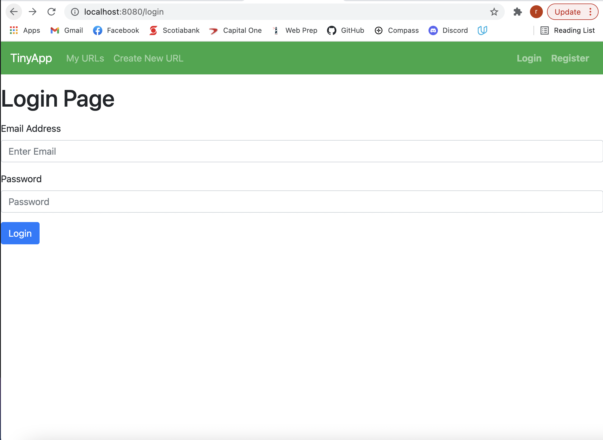

# TinyApp Project

TinyApp is a full stack web application built with Node and Express that allows users to shorten long URLs (à la bit.ly).

## Final Product

## Dependencies
    1. bcryptjs
    2. body-parser
    3. cookie-session!
    4. ejs
    5. express

## DevDependencies
    1. chai
    2. mocha
    3. nodemon

## Getting Started

- Install all dependencies (using the `npm install` command).
- Used Nodemon, a utility that will monitor for any changes in your source and automatically restart your server or can run the development web server using  the `node express_server.js` command.
